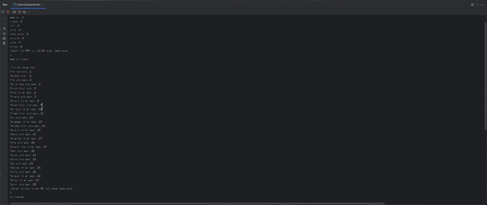
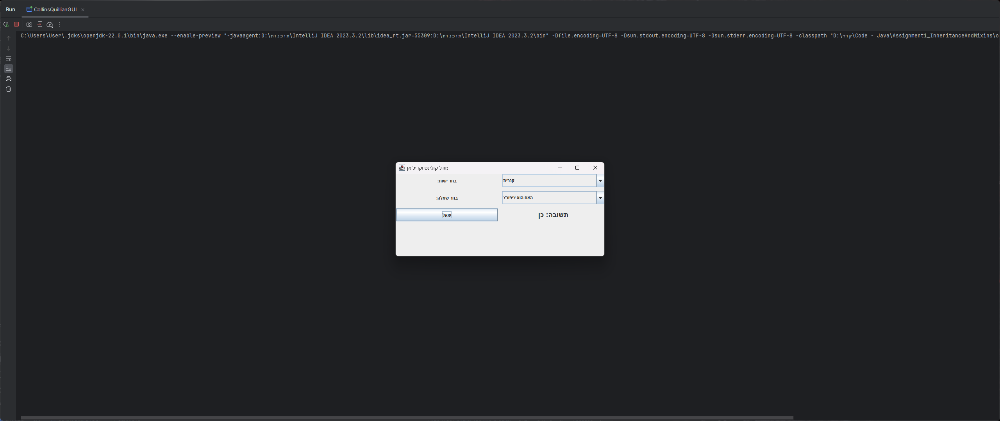
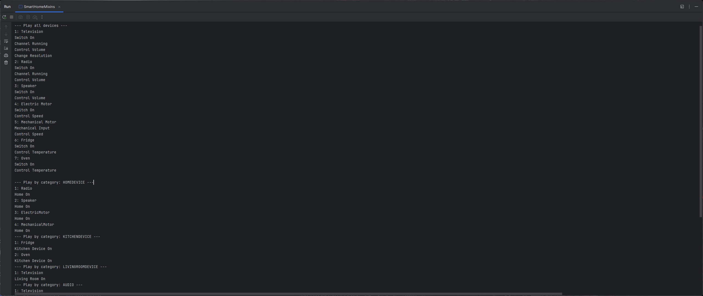

#  Assignment 1 – Object-Oriented Programming 2 (Inheritance and Mixins)
### Semester B • Second Year • College Project


##  Overview

This assignment contains two separate implementations demonstrating the use of inheritance and mixins in Java:

1. **Collins & Quillian Model** – A hierarchical conceptual model for object recognition using abstract classes and traits (interfaces).  
    Includes both **console-based** and **GUI-based** versions.

2. **Smart Home System** – A simulation of electronic devices categorized by room and functionality (e.g., audio, kitchen), controlled by a Smart Remote using mixins and inheritance.

---

##  Team Members

| Name           | Contribution                                       |
|----------------|----------------------------------------------------|
| Yakov Ben-Hamo | Collins & Quillian model (Console + GUI), SmartRemote logic |
| Yura Sushko    | Collins & Quillian model (Console + GUI), SmartRemote logic |

---
## Screenshots
#### Collins & Quillian (Console)

#### Collins & Quillian (GUI)

#### Smart Home Mixins


---

##  How to Run

Use IntelliJ IDEA or any Java compiler:

```bash
javac QueastionOne.CollinsQuillianModel.java
java QueastionOne.CollinsQuillianModel

javac QueastionOne.CollinsQuillianGUI.java
java QueastionOne.CollinsQuillianGUI

javac QueastionTwo.SmartHomeMixins.java
java QueastionTwo.SmartHomeMixins
